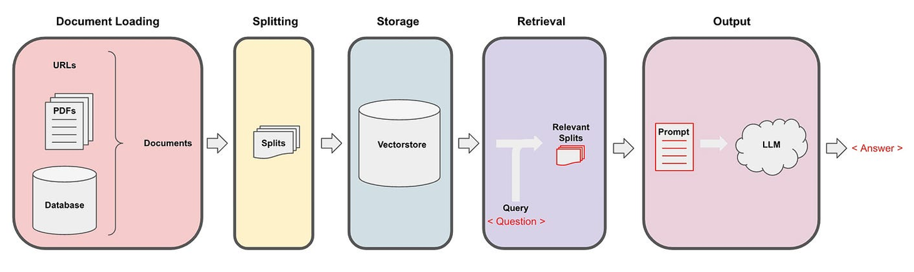

# LangChain Server

## Overview

This project implements a FastAPI-based server for handling generative AI tasks using LangChain's Runnable interfaces. It supports document ingestion, vector database updates, and question-answering functionalities.

## Overview of the Project Pipeline

Below is a pipeline of the Project system:



## Features

- **Document Loading**: Load and process PDF documents into chunks for vector database storage.
- **Vector Database**: Store and retrieve document embeddings for efficient querying.
- **Generative AI**: Answer questions using a combination of document retrieval and a language model.
- **API Endpoints**:
  - `/check`: Health check endpoint.
  - `/generative_ai`: Generate answers for user-provided questions.
  - `/update_db/upload`: Upload a PDF file to update the vector database.
  - `/update_db/url`: Provide a URL to fetch and update the vector database with a PDF.

## Setup

### Prerequisites

- Python 3.10 or higher
- Install dependencies using `pip`:
  ```bash
  pip install -r requirements.txt
  ```

### Environment Variables

Set the following environment variable:
- `TOKENIZERS_PARALLELISM`: Set to `false` to avoid tokenizer parallelism warnings.

### Directory Structure

- `src/rag/file_loader.py`: Handles PDF loading and text splitting.
- `src/rag/vectorstore.py`: Manages the vector database.
- `src/rag/offline_rag.py`: Implements the offline retrieval-augmented generation (RAG) pipeline.
- `src/app.py`: Main FastAPI application.

## Usage

### Running the Server

Start the FastAPI server:
```bash
uvicorn main:app --host 0.0.0.0 --port 5000 --reload
```

### API Endpoints

1. **Health Check**:
   - **GET** `/check`
   - Response: `{"status": "ok"}`

2. **Generative AI**:
   - **POST** `/generative_ai`
   - Request Body:
     ```json
     {
       "question": "Your question here"
     }
     ```
   - Response:
     ```json
     {
       "answer": "Generated answer"
     }
     ```

3. **Update Database via File Upload**:
   - **POST** `/update_db/upload`
   - Form Data: Upload a PDF file.
   - Response: `{"status": "Successfully updated the database with X page."}`

4. **Update Database via URL**:
   - **POST** `/update_db/url`
   - Form Data:
     ```json
     {
       "url": "http://example.com/document.pdf"
     }
     ```
   - Response: `{"status": "Successfully updated the database with X page from URL."}`

## Customization

- Modify `src/rag/file_loader.py` to support additional file types.
- Adjust `chunk_size` and `chunk_overlap` in `Loader` for different text splitting configurations.

## License

This project is licensed under the MIT License. See the `LICENSE` file for details.
